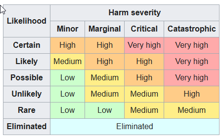

## Source: https://en.wikipedia.org/wiki/Risk_matrix

## Definition
- En risikomatrix bruges til at definere risikoniveauet ved at overveje sandsynlighedskategorien mod konsekvensens alvorlighed.

## Udvikling
- Risikomatrixen har udviklet sig over tid med bidrag fra forskellige organisationer som [[_content/dictionary#U|US]] DoD og [[_content/dictionary#N|NASA]].

## Problemer 
- Der er flere matematiske problemer med risikomatrixer, såsom dårlig opløsning og fejl i risikovurderinger.

## Cybersikkerhed 
- Risikomatrixer bruges ofte i cybersikkerhed, men kan forværre fejl i risikovurderinger.

 
